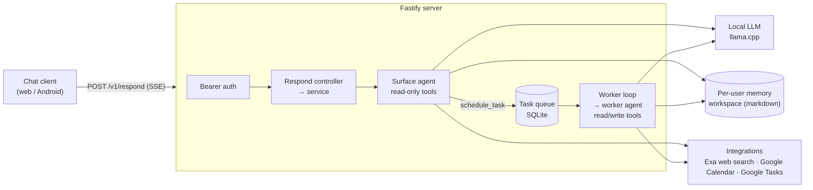

# pi-llm

[](https://github.com/txchin0/pi-llm/actions/workflows/ci.yml)
[](LICENSE)

A personal-assistant backend built around a **two-agent architecture**: a fast, read-only
chat agent answers immediately, and defers anything that writes or takes real action to a
background worker agent that runs it from a durable queue. Both agents run on **local
LLMs** (llama.cpp, OpenAI-compatible) and can be given optional integrations such as web
search, Google Calendar and Google Tasks.

The companion chat client (React web and Capacitor Android) lives in
[ts-llm-frontend](https://github.com/txchin0/ts-llm-frontend).


## Why two agents?

Small local models are slow when they reason and risky when they hold write access.
Splitting the assistant into two roles solves both:

| | Surface agent | Worker agent |
|---|---|---|
| Purpose | Real-time chat, streamed over SSE | Executes queued tasks in the background |
| Latency | Low; thinking off by default | Can think at length |
| Memory | Read (`read`, `ls`, `grep`, `find`) | Read + write (`write`, `edit`) |
| Calendar / Tasks | Read | Read + write |
| Can schedule tasks | Yes (`schedule_task`) | No |
| Talks to the user | Yes | Never directly |

The surface agent keeps the conversation responsive. When the user asks for something
like "add a meeting tomorrow at 2pm" or "remember that I'm allergic to peanuts", it
schedules a **Task** that carries the request plus recent conversation turns. A worker
loop picks it up, runs it with a separate model session, and records the outcome for the
user to see.

## Architecture



The respond path is layered strictly as **routes → controllers → services → ports →
adapters**. Zod contracts validate and translate payloads at the HTTP edge only, and
the root logger is passed in through dependency injection rather than imported as a
global. See [docs/CONTROLLER_SERVICE_REFACTOR.md](docs/CONTROLLER_SERVICE_REFACTOR.md) and
the diagrams in [docs/repo-flow/](docs/repo-flow).

### Highlights

- **Memory as a workspace.** Each user's long-term memory is a small markdown wiki on
  disk: an index plus topic files. The agents navigate it with ordinary filesystem tools.
  The index is injected into the system prompt, and content is loaded on demand. There is
  no vector store.
- **Sandboxing in layers.** The two roles get disjoint tool sets. Sessions are
  cwd-scoped to the user's workspace, traversal and symlink escapes are blocked, and every
  custom tool runs server-side with permission checks.
- **Pluggable integrations.** An integration contributes tools and prompt guidance to a
  role, and users enable integrations individually. See
  [src/integrations/README.md](src/integrations/README.md) for how to add one.
- **Auth.** HS256 access JWTs plus rotating refresh tokens, which are stored hashed,
  with a 60-second reuse grace window for clients that race. Passwords use scrypt behind
  a swappable hasher interface, and comparisons are timing-safe. Google OAuth connect
  uses PKCE.
- **Durable queue.** Tasks live in SQLite (Drizzle ORM migrations). The worker runs one
  task at a time, with retries, timeouts, graceful shutdown and optional per-task run
  traces.
- **Structured logging.** Pino, with correlation IDs on every line and secrets redacted.
  Full message and tool payloads are logged only at `debug`.

## Tech stack

TypeScript (maximally strict `tsconfig`) · Node.js 24 · Fastify 5 · Server-Sent Events ·
[Pi coding-agent SDK](https://www.npmjs.com/package/@earendil-works/pi-coding-agent) ·
llama.cpp · SQLite (better-sqlite3) + Drizzle ORM · Zod · Pino · Google APIs ·
Model Context Protocol (Exa search) · Vitest · ESLint

## Getting started

**Prerequisites:** Node.js 24 or later, and a running
[llama.cpp](https://github.com/ggml-org/llama.cpp) server (or any OpenAI-compatible
endpoint).

```bash
npm install
cp .env.example .env   # point SURFACE_/WORKER_LLM_BASE_URL at your model server
npm run dev            # starts on http://localhost:3000
```

Google Calendar and Google Tasks are optional. To enable them, set the `GOOGLE_OAUTH_*`
variables in `.env`. Without them, the server runs in an "unconfigured OAuth" mode, and
those integrations report "not connected". All supported variables are listed in
[src/config/env.ts](src/config/env.ts).

## API

| Method | Path | Purpose |
|---|---|---|
| `POST` | `/v1/auth/{register,login,refresh,logout}` | Account and token lifecycle |
| `POST` | `/v1/respond` | Send a message; the reply streams as SSE (`start`, `delta`, `tool_call`, `tool_result`, `usage`, `final`, …) |
| `GET` | `/v1/tasks` | List the user's deferred tasks and their outcomes |
| `POST` | `/v1/tasks/:taskId/dismiss` | Dismiss a finished task |
| `GET` / `PUT` | `/v1/integrations` | View or toggle per-user integrations |
| `*` | `/v1/oauth/:providerId/...` | OAuth connect flow (start, callback, status, disconnect) |

The SSE wire format is documented in [API.md](API.md).

## Testing

```bash
npm test            # unit + integration tests (offline, no model required)
npm run typecheck
npm run lint
npm run test:e2e    # live-LLM scenarios (requires a running model endpoint)
```

The **e2e suite** runs real conversations against a live model. Each scenario drives the
full surface → queue → worker path and checks hard assertions (for example, that a
task was queued and that a fact was persisted to memory). It also grades responses with an
**LLM-as-judge** rubric and writes an HTML report. Scenarios can be repeated
(`E2E_TRIALS`) to measure flakiness when comparing models.

## Project docs

- [DESIGN.md](DESIGN.md): the full solution design (agents, queue, memory, sandboxing,
  security)
- [CONTEXT.md](CONTEXT.md): domain language (Role, Surface, Worker, Task, Integration)
- [API.md](API.md): the HTTP and SSE contract with the chat client
- [src/integrations/README.md](src/integrations/README.md): guide to adding an
  integration

## License

[MIT](LICENSE)
