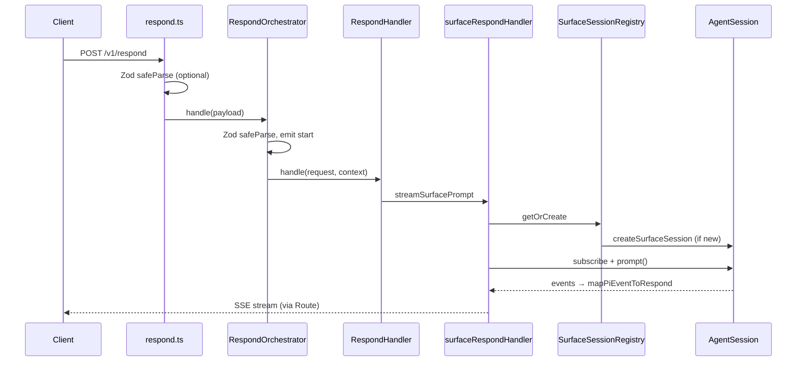
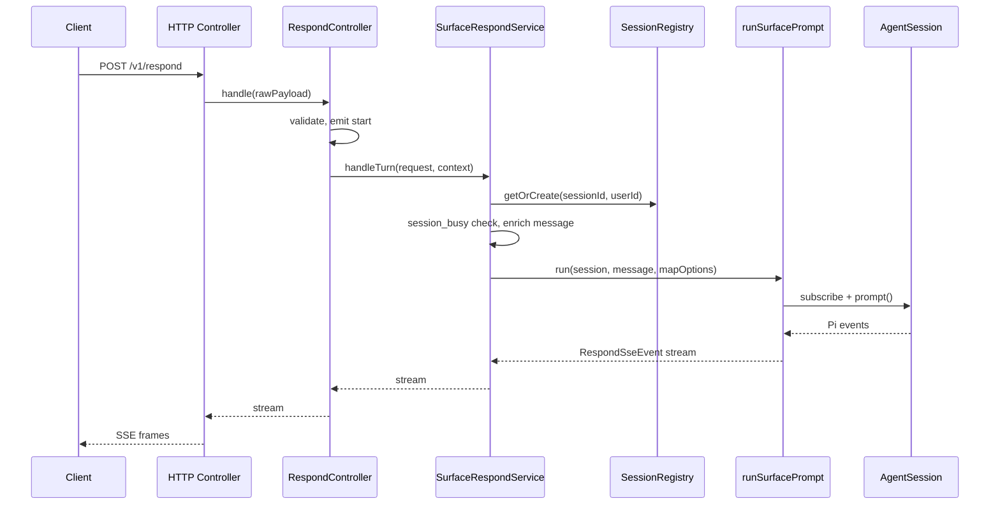

# Controller–Service Refactor Proposal

This document describes a proposed restructuring of the respond path in pi-llm. The goal is to align the codebase with a **controller–service–runner** pattern: clear boundaries, predictable naming, and room to add the worker agent and task queue without tangling Pi SDK mechanics into business logic.

**Status:** Implemented. Subsequent cleanup removed production noop defaults; route tests use `tests/helpers/buildTestServer.ts` with explicit stub dependencies.

**Layout:** `src/agent/`, `src/respond/`, `src/surface/` (see §5).

**Related docs:** [DESIGN.md](../DESIGN.md), [AGENTS.md](../AGENTS.md)

---

## 1. Summary

| Layer | Role | File(s) |
|-------|------|---------|
| HTTP route | SSE transport, headers, stream to client | `src/server/routes/respond.ts` |
| Application controller | Validate request, assign IDs, emit `start`, delegate | `src/respond/respondController.ts` |
| Service contract | Interface for “handle one chat turn” | `src/respond/respondService.ts` |
| Service implementation | Surface chat business flow | `src/surface/surfaceRespondService.ts` |
| Pi runner | Subscribe, prompt, event queue, unsubscribe | `src/agent/runAgentPrompt.ts` |
| Repository | Long-lived sessions keyed by `session_id` | `src/surface/surfaceSessionRegistry.ts` |
| Agent factory | Pi harness setup (tools, cwd, system prompt) | `src/surface/createSurfaceSession.ts` |
| Test double | Stub respond service for route tests | `tests/helpers/stubRespondService.ts` via `tests/helpers/buildTestServer.ts` |

Renaming, folder restructure, and runner extraction. No change to the HTTP contract (`POST /v1/respond` SSE events) or to `DESIGN.md` architecture.

---

## 2. Motivation

### 2.1 What works today

The respond path already has sensible layering:

```
routes/respond.ts → RespondOrchestrator → RespondHandler → Pi AgentSession
```

- `RespondOrchestrator` validates input, creates correlation IDs, emits `start`, and delegates — classic **application controller** behavior.
- `RespondHandler` is a swappable port (stub vs surface) — good for testing and future backends.
- `createSurfaceSession` and `SurfaceSessionRegistry` already isolate Pi session construction and lifecycle.

### 2.2 What is unclear

| Issue | Why it matters |
|-------|----------------|
| **“Handoff” naming** | `respondHandoff.ts` sounds like a one-time transfer, not a service contract. New contributors will look for a “service” and miss it. |
| **“Handler” overload** | Fastify has handlers; `RespondHandler` and `surfaceRespondHandler` blur HTTP vs domain layers. |
| **Mixed concerns in `surfaceRespondHandler.ts`** | Session lookup and `session_busy` (service) sit beside `subscribe` / queue drain / `setImmediate` (Pi runner). Hard to unit-test or reuse for the worker agent. |
| **Double validation** | `respond.ts` and `RespondOrchestrator` both run `RespondRequestSchema.safeParse`. |
| **Stale stub comment** | `stubRespondHandler` says “until Pi surface agent is wired in” but production uses the surface handler via `index.ts`. |

### 2.3 Design alignment

[DESIGN.md](../DESIGN.md) describes a **single-process control plane** with two agent roles (surface and worker). A consistent controller–service–runner shape per use case makes it straightforward to add:

```
WorkerLoop (controller) → WorkerTaskService → runWorkerPrompt (runner)
```

without copying Pi streaming logic.

---

## 3. Current architecture

### 3.1 Request flow



### 3.2 File responsibilities (today)

#### `src/server/routes/respond.ts` — HTTP layer

- Hijacks Fastify reply for SSE.
- Optionally pre-validates body with Zod.
- Iterates `orchestrator.handle()` and writes SSE frames.
- Logs request received / completed / failed.

#### `src/runtime/respondOrchestrator.ts` — Application entry

- Validates `rawRequest` with `RespondRequestSchema`.
- Generates `request_id` and `session_id` (when omitted).
- Logs inbound message (via `logInboundMessage`).
- Yields `start` or `validation_error`.
- Delegates to `RespondHandler`.

#### `src/runtime/respondHandoff.ts` — Service contract only

- Defines `RespondContext` and `RespondHandler` interface.
- No implementation.

#### `src/runtime/surface/surfaceRespondHandler.ts` — Service + runner (mixed)

**Service-like (should stay in service):**

- Resolve session from registry.
- Check `session.isStreaming` → `session_busy` error.
- Build mapper context (`show_thinking`, timestamps).
- Map Pi failures to `agent_error` SSE events.

**Runner-like (should move to `runSurfacePrompt.ts`):**

- `waitForNextTick` / event-loop draining.
- `session.subscribe` with internal queue.
- `session.prompt(...)` promise lifecycle.
- `unsubscribe` in `finally`.

#### `src/runtime/surface/surfaceSessionRegistry.ts` — Repository

- `Map<SessionId, AgentSession>`.
- `getOrCreate(sessionId, userId)` calls `createSurfaceSession`.

#### `src/runtime/surface/createSurfaceSession.ts` — Agent factory

- Validates LLM endpoint, ensures workspace, calls `createAgentSession` from Pi SDK.
- Configures read-only tools, system prompt, in-memory session manager.

#### `src/runtime/stubRespondHandler.ts` — Test default

- Empty async generator; used when `buildServer()` is called without a handler override.

---

## 4. Proposed architecture

### 4.1 Target flow



### 4.2 Two controllers (intentional)

| Controller | Location | Responsibility |
|------------|----------|----------------|
| **HTTP controller** | `server/routes/respond.ts` | Transport only: headers, SSE encoding, write stream, request duration logging. |
| **Application controller** | `runtime/respondController.ts` | Use-case entry: validation, IDs, `start` event, correlation logging, delegate to service. |

This is normal in layered apps. The HTTP controller must not import Pi SDK types. The application controller must not know about Fastify or raw SSE byte formatting.

### 4.3 Layer boundaries

#### HTTP controller (`respond.ts`)

**Does:**

- Set SSE response headers.
- Pass raw or parsed body to application controller (prefer raw — see §6.3).
- Forward each `RespondSseEvent` through `writeSseEvent`.
- Handle transport-level failures (connection dropped, unhandled throw).

**Does not:**

- Assign `session_id` for first-turn requests.
- Call Pi SDK.
- Enrich user messages.

#### Application controller (`RespondController`)

**Does:**

- Parse and validate with `RespondRequestSchema`.
- Create `request_id`, `session_id`, `started_at`.
- Emit `start` or `validation_error`.
- Create child logger with `component: 'respond.controller'`.
- Call `service.handleTurn(request, context)` and yield results.

**Does not:**

- Subscribe to Pi events.
- Manage `AgentSession` lifetime beyond passing IDs to the service.

#### Service contract (`RespondService`)

```typescript
export type RespondContext = {
  requestId: RequestId;
  sessionId: SessionId;
  startedAt: string;
  logger?: AppLogger;
};

export interface RespondService {
  handleTurn(
    request: RespondRequest,
    context: RespondContext,
  ): AsyncIterable<RespondSseEvent>;
}
```

Implementations:

| Implementation | Purpose |
|----------------|---------|
| `SurfaceRespondService` | Production chat via Pi surface agent |
| `noopRespondService` | Default for `buildServer()` in tests |
| *(future)* `WorkerTaskService` | Background task execution (different controller) |

#### Service implementation (`SurfaceRespondService`)

**Does:**

- `registry.getOrCreate(context.sessionId, request.user_id)`.
- Return `session_busy` if `session.isStreaming`.
- `enrichUserMessage(request.message, now)` from `src/agent/piMessageText.ts`.
- Build `mapPiEventForRequest` options (request, mapper context, state).
- Invoke `runSurfacePrompt(session, enrichedMessage, mapFn)`.
- Catch runner errors and yield `agent_error` with structured logging.

**Does not:**

- Own the subscribe/queue/`setImmediate` loop (delegates to runner).
- Create Pi sessions directly (uses registry).

#### Pi runner (`runSurfacePrompt.ts`)

**Does:**

- Accept an existing `AgentSession`, prompt text, and an event-mapping callback.
- `session.subscribe` → push mapped `RespondSseEvent`s into a queue.
- `session.prompt(message)` with promise error capture.
- Drain queue until prompt completes (including `waitForNextTick`).
- Always `unsubscribe` in `finally`.
- Re-throw or surface prompt errors to the service layer.

**Does not:**

- Know about `RespondRequest`, `user_id`, or session registry.
- Emit `session_busy` (service decides before calling runner).
- Enrich messages.

#### Repository (`SurfaceSessionRegistry`) — unchanged

Session lookup and creation keyed by server-issued `session_id`.

#### Agent factory (`createSurfaceSession`) — unchanged

Pi harness configuration for a new conversation thread.

---

## 5. File layout (implemented)

```
src/
├── agent/
│   ├── runAgentPrompt.ts           # shared Pi subscribe/prompt loop
│   └── piMessageText.ts            # enrichUserMessage · getMessageText
├── respond/
│   ├── respondController.ts
│   ├── respondService.ts
│   └── noopRespondService.ts
├── surface/
│   ├── surfaceRespondService.ts
│   ├── surfaceSessionRegistry.ts
│   ├── createSurfaceSession.ts
│   ├── mapPiEventToRespond.ts
│   └── ...
└── server/
    └── routes/respond.ts
```

`src/index.ts` wiring:

```typescript
const service = createSurfaceRespondService({ registry, logger });
const app = buildServer({ logger, service });
```

---

## 6. Detailed code sketches

### 6.1 `respondService.ts` (renamed from `respondHandoff.ts`)

```typescript
import type {
  RequestId,
  RespondRequest,
  RespondSseEvent,
  SessionId,
} from '../contracts/respond.js';
import type { AppLogger } from '../logging/index.js';

export type RespondContext = {
  requestId: RequestId;
  sessionId: SessionId;
  startedAt: string;
  logger?: AppLogger;
};

/** Executes one validated respond turn and streams SSE events after `start`. */
export interface RespondService {
  handleTurn(
    request: RespondRequest,
    context: RespondContext,
  ): AsyncIterable<RespondSseEvent>;
}
```

**Breaking rename:** `RespondHandler` → `RespondService`, `handle` → `handleTurn`.

Using `handleTurn` avoids collision with Fastify route handlers and reads clearly at the call site:

```typescript
yield* this.service.handleTurn(request, context);
```

### 6.2 `respondController.ts` (from `respondOrchestrator.ts`)

Rename class and log component; behavior unchanged:

```typescript
export type RespondControllerDependencies = {
  service?: RespondService;
  logger?: AppLogger;
  now?: () => string;
  requestIdFactory?: () => RequestId;
  sessionIdFactory?: () => SessionId;
};

export class RespondController {
  private readonly service: RespondService;
  // ...

  constructor(dependencies: RespondControllerDependencies = {}) {
    this.service = dependencies.service ?? noopRespondService;
    // ...
  }

  async *handle(rawRequest: unknown, options: HandleRequestOptions = {}) {
    // validate → start → yield* this.service.handleTurn(...)
  }
}
```

No deprecation alias — all in-repo references were updated in one pass.

### 6.3 `respond.ts` — remove duplicate validation

**Before:** `prepareRespondPayload` runs Zod in the route.

**After:** Pass `request.body` directly to the controller:

```typescript
for await (const event of options.controller.handle(request.body, {
  requestId,
  logger: log,
})) {
  // ...
}
```

Single validation site = application controller.

### 6.4 `runAgentPrompt.ts` (implemented in `src/agent/`)

```typescript
import type { AgentSession, AgentSessionEvent } from '@earendil-works/pi-coding-agent';

export type AgentPromptMapper = (event: AgentSessionEvent) => RespondSseEvent[];
```

Uses a **promise-backed queue** (not `setImmediate` polling): `subscribe` resolves a pending waiter when events arrive; the generator drains synchronously then awaits the next push.

The mapper closure is built by the service so `runAgentPrompt` stays ignorant of `RespondRequest` and `mapPiEventForRequest` state.

#### Known limitations (runner)

- **No backpressure:** the in-memory event queue is unbounded. Assumes a fast local consumer (SSE route). Slow or stalled clients can grow memory without limit.
- **Mapper errors:** `mapEvent` runs inside Pi's synchronous `subscribe` callback. Throws there surface in Pi's emit path — the service `try/catch` around `yield* runAgentPrompt(...)` covers **prompt/runner** failures only, not mapper throws.

### 6.5 `surfaceRespondService.ts` (slimmed handler)

```typescript
export function createSurfaceRespondService(
  dependencies: SurfaceRespondServiceDependencies,
): RespondService {
  return {
    async *handleTurn(request, context) {
      const now = dependencies.now ?? (() => formatNowInTimezone());
      const log = context.logger ?? dependencies.logger;

      const session = await dependencies.registry.getOrCreate(
        context.sessionId,
        request.user_id,
      );

      if (session.isStreaming) {
        yield {
          type: 'error',
          request_id: context.requestId,
          code: 'session_busy',
          message: 'Surface session is already processing a request.',
        };
        return;
      }

      const mapperState = createPiEventMapperState();
      const mapperContext = {
        requestId: context.requestId,
        sessionId: context.sessionId,
        showThinking: request.show_thinking === true,
        completedAt: now,
      };

      try {
        yield* runAgentPrompt(
          session,
          enrichUserMessage(request.message, now),
          {
            mapEvent: (event) =>
              mapPiEventForRequest(event, {
                request,
                context: mapperContext,
                state: mapperState,
              }),
          },
        );
      } catch (error) {
        log?.error({ event: 'agent.error', err: error }, 'surface agent prompt failed');
        yield {
          type: 'error',
          request_id: context.requestId,
          code: 'agent_error',
          message:
            error instanceof Error
              ? error.message
              : 'Surface agent failed to complete the request.',
        };
      }
    },
  };
}
```

### 6.6 `noopRespondService.ts`

```typescript
import type { RespondService } from './respondService.js';

/** Yields no events; used when buildServer() runs without a production service. */
export const noopRespondService: RespondService = {
  async *handleTurn() {},
};
```

---

## 7. Migration checklist

Execute in order to keep the app runnable after each step.

### Phase 1 — Extract runner (no public API change)

- [ ] Create `src/runtime/surface/runSurfacePrompt.ts` with extracted loop.
- [ ] Update `surfaceRespondHandler.ts` to call `runSurfacePrompt`.
- [ ] Run `npm test` and manual smoke test via `npm run dev`.

### Phase 2 — Rename service contract

- [ ] Add `respondService.ts` with `RespondService` / `handleTurn`.
- [ ] Update imports in handler, orchestrator, stub.
- [ ] Delete `respondHandoff.ts`.
- [ ] Run tests.

### Phase 3 — Rename implementations

- [ ] Rename `surfaceRespondHandler.ts` → `surfaceRespondService.ts`.
- [ ] Rename `createSurfaceRespondHandler` → `createSurfaceRespondService`.
- [ ] Rename `stubRespondHandler.ts` → `noopRespondService.ts`.
- [ ] Update `src/index.ts`, `buildServer.ts`.
- [ ] Run tests.

### Phase 4 — Rename controller (optional)

- [ ] Rename `respondOrchestrator.ts` → `respondController.ts`.
- [ ] Rename `RespondOrchestrator` → `RespondController`.
- [ ] Update `handler` → `service` in `RespondControllerDependencies`.
- [ ] Update `buildServer.ts`, `respond.ts`, tests.
- [ ] Run tests.

### Phase 5 — Route cleanup

- [ ] Remove `prepareRespondPayload` / duplicate Zod in `respond.ts`.
- [ ] Run tests.

### Phase 6 — Docs and comments

- [ ] Update cross-references in `docs/PI_SDK_REPORT.md` if still relevant.
- [ ] Add one-line pointer from `AGENTS.md` or `DESIGN.md` to this doc (optional).

---

## 8. Files to touch (complete list)

| File | Action |
|------|--------|
| `src/runtime/respondHandoff.ts` | Replace with `respondService.ts` |
| `src/runtime/respondOrchestrator.ts` | Rename → `respondController.ts` (optional) |
| `src/runtime/stubRespondHandler.ts` | Rename → `noopRespondService.ts` |
| `src/runtime/surface/surfaceRespondHandler.ts` | Rename → `surfaceRespondService.ts`, slim |
| `src/runtime/surface/runSurfacePrompt.ts` | **Create** |
| `src/server/routes/respond.ts` | Remove duplicate validation; rename orchestrator import |
| `src/server/buildServer.ts` | `handler` → `service`, orchestrator → controller |
| `src/index.ts` | `createSurfaceRespondService` |
| `docs/PI_SDK_REPORT.md` | Update symbol names (§19 references) |

**No changes expected:**

- `contracts/respond.ts`
- `mapPiEventToRespond.ts`
- `surfaceSessionRegistry.ts`
- `createSurfaceSession.ts`
- `piMessageText.ts` (agent layer; replaces former `surface/util/enrichUserMessage.ts`)

---

## 9. Testing impact

### 9.1 Existing tests

Integration tests use `buildTestServer()` from `tests/helpers/buildTestServer.ts`, which supplies `createStubRespondService()` plus stub task queue and integration store. Override `service` when testing production respond paths (for example `createSurfaceRespondService` with a mock registry).

### 9.2 New tests to add (recommended)

| Test | File | What it asserts |
|------|------|-----------------|
| `runSurfacePrompt` unit | `tests/runtime/runSurfacePrompt.test.ts` | Mock `AgentSession` with controlled subscribe/prompt; verify event order and unsubscribe |
| `SurfaceRespondService` unit | `tests/runtime/surfaceRespondService.test.ts` | Mock registry returning busy session → `session_busy`; mock runner called with enriched message |
| `RespondController` unit | `tests/runtime/respondController.test.ts` | Invalid body → `validation_error`; valid → `start` then service events |

### 9.3 Runner test pattern (sketch)

```typescript
const events: RespondSseEvent[] = [];
const session = {
  isStreaming: false,
  subscribe(cb) {
    cb({ type: 'text_delta', text: 'hi' });
    return () => {};
  },
  prompt: async () => {},
};

for await (const e of runSurfacePrompt(session, 'hello', {
  mapEvent: () => [{ type: 'delta', /* ... */ }],
})) {
  events.push(e);
}
```

---

## 10. Future extension: worker agent

The same pattern applies to background work:

```
src/worker/
├── workerLoop.ts              # Controller: idle detection, dequeue
├── workerTaskService.ts       # Service: pick task, scope workspace, errors
├── runWorkerPrompt.ts         # Runner: Pi subscribe/prompt (may share utilities with surface)
└── createWorkerSession.ts     # Factory: write tools, worker system prompt
```

**Shared candidate:** Generic `runAgentPrompt(session, message, mapEvent)` if surface and worker loops are identical; keep separate files initially and extract only when duplication is proven.

**Not shared:** `SurfaceRespondService` vs `WorkerTaskService` — different inputs (HTTP request vs queued task), error codes, and tool permissions.

---

## 11. Decisions log

| Decision | Options | Recommendation |
|----------|---------|----------------|
| Rename orchestrator → controller | Yes / No | **Yes** — clean rename, no alias |
| `handle` vs `handleTurn` on service | `handle` / `handleTurn` | **`handleTurn`** — disambiguates from HTTP handlers |
| Runner location | `surface/` vs `agent/` | **`src/agent/`** — shared by surface and future worker |
| Queue mechanism | `setImmediate` poll / promise-backed | **Promise-backed** — lower latency, reusable for worker |
| Error mapping in service vs runner | Service / Runner | **Service** — runner stays Pi-mechanics only |

---

## 12. Non-goals (this refactor)

- Splitting into separate microservices or processes.
- Changing SSE event shapes or `POST /v1/respond` contract.
- Adding worker, queue, or tool gateway modules. *(Task queue enqueue + `schedule_task` were added later in `src/queue/` — see DESIGN.md §5.7.)*
- Replacing manual env parsing with Zod in config.

---

## 13. Acceptance criteria

The refactor is complete when:

1. No file is named `*Handoff*` or `*RespondHandler*` (except historical git history).
2. `runSurfacePrompt.ts` contains all subscribe/queue/prompt loop logic.
3. `SurfaceRespondService` has no `waitForNextTick` or direct `session.subscribe`.
4. Request body is validated in exactly one place (application controller).
5. `npm run typecheck` and `npm test` pass.
6. Manual chat smoke test against running dev server still streams deltas and completes turns.

---

## 14. Glossary

| Term | Definition |
|------|------------|
| HTTP controller | `respond.ts` — SSE transport |
| Application controller | `RespondController` — respond use-case entry |
| Service | Domain logic for one respond turn (`SurfaceRespondService`) |
| Runner | Pi SDK streaming adapter (`runSurfacePrompt`) |
| Repository | `SurfaceSessionRegistry` — session lookup by `session_id` |
| Factory | `createSurfaceSession` — new Pi harness instance |
